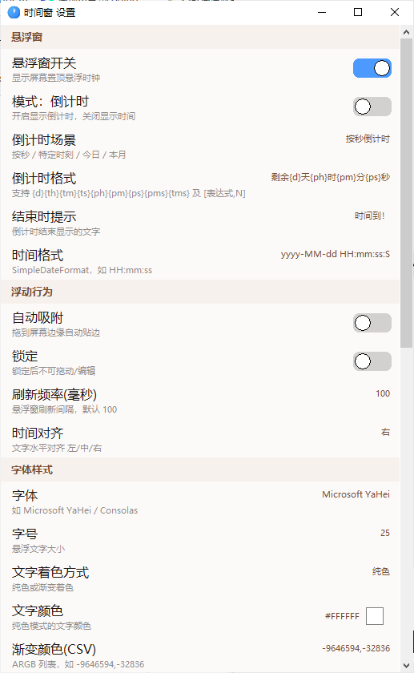

# ⏰ 时间窗 TimeWindow

**Windows 悬浮时钟 · Floating Clock for Windows**

基于 Android 应用 `com.likpia.timewindow` 完整复刻的**单文件 Windows 版本**，纯 Win32/GDI+ 实现，无 Electron、无运行时依赖，EXE 仅约 290 KB（远低于 5MB 限制）。

[中文目录](#中文) · [English TOC](#english) · [下载 Releases](#下载-下载) · [仓库地址](https://github.com/Yichenlemon/timewindow)

---

## 中文

一个可悬浮在任意窗口上的实时时钟工具，支持 18 种时间格式（含农历、天干地支、生肖）、自定义格式、颜色与透明度主题，一键常驻系统托盘。

### 目录
- [功能特性](#功能特性)
- [18 种时间格式](#18-种时间格式)
- [下载与安装](#下载与安装)
- [界面截图](#界面截图)
- [使用说明](#使用说明)
- [界面与主题](#界面与主题)
- [从源码编译](#从源码编译)
- [关于](#关于)

### 功能特性
- 🕘 **悬浮时钟**：透明无边框小窗，可拖动、可锁定，始终置顶显示当前时间
- 📅 **18 种时间格式**：还原原版全部预设，含农历日期、天干地支、十二生肖
- ⚙️ **自定义格式**：提供预设选择器 + 完整格式说明，支持手动输入高级格式
- 🎨 **主题定制**：主界面背景、分区标题背景均可自定义颜色；悬浮窗支持透明度调节
- 🖱️ **平滑滚动**：设置界面双缓冲渲染，滚轮平滑滚动且遵循 Windows 系统滚动行数设置
- 🌈 **统一图标**：托盘、标题栏、任务栏、文件图标采用一致的线性渐变蓝钟表
- 🪟 **单文件交付**：单 EXE，无控制台窗口，`-mwindows` 编译；内含图标与 UTF-8 中文资源信息

### 界面截图
两张图左右并排，下方为图注。

<table>
  <tr>
    <td align="center"></td>
    <td align="center"></td>
  </tr>
  <tr>
    <td align="center"><em>主设置界面 · 完整配置项</em></td>
    <td align="center"><em>悬浮时钟 · 实时显示（GIF）</em></td>
  </tr>
</table>

### 18 种时间格式
还原自原版 APP 的全部预先格式，覆盖年份、月份、星期、时分秒，并完整保留：
- **农历**（初几、几月）
- **天干地支**（年份干支）
- **十二生肖**
- **毫秒等级别精度**（HH:mm:ss:S / :SS / :SSS）

### 下载与安装
前往 [Releases](https://github.com/Yichenlemon/timewindow/releases) 下载最新版的 `timewindow.exe`，直接运行即可，无需安装任何运行库。

### 使用说明
- 拖动悬浮窗边缘可移动；右键悬浮窗或托盘图标可呼出菜单
- 托盘菜单支持：显示设置 / 显示悬浮窗 / 隐藏悬浮窗 / 退出
- 设置界面可切换时间格式、自定义格式、主题颜色与透明度

### 界面与主题
- 背景色：可通过「设置 → 主界面背景色」选择
- 分区标题背景：可通过「设置 → 分区标题背景色」选择
- 悬浮窗透明度：通过「设置 → 背景不透明度」调节（0–255）

### 从源码编译
需要 **MinGW-w64 + GDI+（`libgdiplus`）**：

```bash
g++ timewindow.c timewindow.res -o timewindow.exe -mwindows \
    -lgdiplus -lshlwapi -lole32 -luxtheme -lcomctl32 \
    -lwinmm -luser32 -lgdi32 -lshell32 -lcomdlg32
```

其中 `timewindow.res` 由 `windres timewindow.rc -O coff -o timewindow.res` 生成（内含应用 manifest、图标与版本信息）。图标源文件为 `app.ico`，可用 `icon_gen.py`（需 Pillow）重新生成。

### 关于
- © 亦辰曦
- 🔄 复刻自：`com.likpia.timewindow`
- 本项目仅供学习与交流使用。

---

## English

A lightweight **floating clock** for Windows, fully faithful to the Android app `com.likpia.timewindow`, rebuilt as a **single self-contained EXE** with native Win32/GDI+. No Electron, no runtime dependency — the binary is only ~290 KB (far under the 5 MB limit).

<div id="english"></div>

### TOC
- [Features](#features)
- [18 Time Formats](#18-time-formats)
- [Download & Install](#download--install)
- [Usage](#usage)
- [UI & Theme](#ui--theme)
- [Build from Source](#build-from-source)
- [About](#about)

### Features
- 🕘 **Floating clock**: transparent, borderless, draggable, always-on-top live time
- 📅 **18 time formats**: all original presets including **Lunar calendar, Heavenly Stems / Earthly Branches, and the Chinese zodiac**
- ⚙️ **Custom format**: preset picker + full format documentation, plus manual entry
- 🎨 **Theme**: customizable background colors and floating-window opacity
- 🖱️ **Smooth scrolling**: double-buffered settings UI, wheel speed follows system setting
- 🌈 **Consistent icon**: tray / title bar / taskbar / file icon share one gradient-blue clock
- 🪟 **Single file**: no console window (`-mwindows`), icon + UTF-8 Chinese version info embedded

### Screenshots
Two images side by side, with captions below.

<table>
  <tr>
    <td align="center"></td>
    <td align="center"></td>
  </tr>
  <tr>
    <td align="center"><em>Settings window · full configuration</em></td>
    <td align="center"><em>Floating clock · live display (GIF)</em></td>
  </tr>
</table>

### 18 Time Formats
All presets restored from the original app, covering year / month / weekday / time, including:
- **Lunar calendar** dates
- **Heavenly Stems & Earthly Branches** (year)
- **Chinese zodiac**
- **Millisecond precision** (`HH:mm:ss:S` / `:SS` / `:SSS`)

### Download & Install
Grab the latest `timewindow.exe` from the [Releases](https://github.com/Yichenlemon/timewindow/releases) page and run it — no extra runtime required.

### Usage
- Drag the floating window to move; right-click it or the tray icon for the menu
- Tray menu: Show Settings / Show Floating / Hide Floating / Quit
- Settings let you switch formats, custom format, theme colors and opacity

### UI & Theme
- Background color: via “Settings → Main background color”
- Section title background: via “Settings → Section title background color”
- Floating-window opacity: via “Settings → Background opacity” (0–255)

### Build from Source
Requires **MinGW-w64 + GDI+ (`libgdiplus`)**:

```bash
g++ timewindow.c timewindow.res -o timewindow.exe -mwindows \
    -lgdiplus -lshlwapi -lole32 -luxtheme -lcomctl32 \
    -lwinmm -luser32 -lgdi32 -lshell32 -lcomdlg32
```

`timewindow.res` comes from `windres timewindow.rc -O coff -o timewindow.res` (embeds the manifest, icon and version info). The icon source is `app.ico`; regenerate it with `icon_gen.py` (requires Pillow) if needed.

### About
- © 亦辰曦
- 🔄 Clone of: `com.likpia.timewindow`
- Made for learning and sharing. Please respect the original app’s license.

---

> ⚠️ 本项目仅为个人学习复刻，若用于商业或分发请自行评估版权与许可风险。